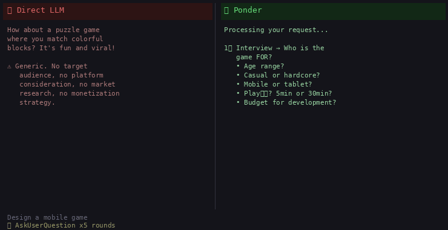

<p align="center">
  
  
  
</p>

<h1 align="center">🧠 Ponder</h1>

<p align="center">
  <b>LLMs answer. Ponder thinks. Then answers.</b><br>
  <i>Code-structured reasoning · Gets smarter with every use · Domain-agnostic</i>
</p>

<p align="center">
  <a href="README_CN.md">🇨🇳 中文</a>
  &nbsp;·&nbsp;
  <code>/luke:ponder &lt;your question&gt;</code>
</p>

<br>

---

## ✨ Every time you ask an AI, you take a gamble.

Will it nail it this time? Miss something obvious? Give you the same confident-sounding surface take it gave last time — and was wrong?

**That's not a model problem. It's a process problem.**

LLMs answer the moment you ask. Ponder doesn't. Its complete entry runs ten stages in a fixed order: interview → shensi → divergence → bagua → plans → converge → score → simulate → debate → synthesis. Ponder alone enforces three anti-skip layers: stage instructions, transition guards, and completion validation.

The result isn't faster answers. It's **answers you can trust**.

And every answer makes the next one better — because every run stores structured knowledge. The system remembers what worked, what didn't, and what you corrected.

---

### One glance tells the story

```
You ask a question
         ↓
┌──────────────────────────────────────────────────┐
│           Interview (5-dimension profile)         │
├──────────────────────────────────────────────────┤
│       shensi      →      divergence               │
│          ↓                   ↓                     │
│        bagua       →        plans                  │
│          ↓                   ↓                     │
│       converge     →        score                  │
│          ↓                   ↓                     │
│       simulate     → debate → synthesis            │
└──────────────────────────────────────────────────┘
         ↓
Every phase verified, every result accumulated. Next time is sharper.
```

<br>

### See the difference



*Direct LLM answer vs the same question through Ponder's complete ten-stage process.*

```
You ask → interview → shensi → divergence → bagua → plans
       → converge → score → simulate → debate → synthesis

Every step feeds back into memory. Every run makes the next one sharper.
```

### What makes it different

| Capability | Why It Matters |
|---|---|
| 🎯 **Requirement Refinement** | The first phase isn't analysis — it's making sure you're solving the right problem. Iterative, option-based questioning until the picture is clear. |
| 🌪️ **Frame-breaking** | Not "think harder." A structured 5-step cognitive process (empty the mind → focus → wander → image → connect) to force genuinely unexpected insights. |
| 👁️ **Blindspot Discovery** | 8 dimensions systematically scan for what you didn't know you were missing. Surfaces the hidden assumptions before they become blindspots in your decision. |
| 📊 **8-Dimension Scoring** | Every proposed solution is scored across 8 orthogonal dimensions (feasibility, resilience, risk, penetration...) without collapsing judgment into a single-point rating. |
| ⚔️ **Debate Under Fire** | Solutions don't just get compared — they get attacked. Each solution faces combined criticism from all others. The winner is the one that survives, not the one that sounds best. |
| 🧠 **Persistent Memory** | Every analysis is stored as structured knowledge. Future runs automatically recall top-3 most relevant past experiences per phase. The system gets smarter with use. |
| 🔄 **Self-Learning** | Weight registry adjusts coefficients based on real outcomes. Knowledge grooming decays unused data, promotes valuable patterns, sleeps low-quality entries. |

---

## 🏗 Architecture at a Glance

```
ONE luke PLUGIN
├── Nine Skills
│   ├── ponder: interview → shensi → divergence → bagua → plans
│   │           → converge → score → simulate → debate → synthesis
│   └── Eight independent specialists: interview, explore, blindspots,
│       solutions, simulate, debate, synthesis, memory
├── skills/<owner>/resources/     owner-local prompts and schemas
├── engine/                       shared root reasoning foundations
├── MMA                           philosophy, knowledge, step_history
├── mcts gateway                  compute, l10n, knowledge, profile
└── runtime                       PONDER_DATA_DIR; Plugin is read-only
```

Only Ponder owns orchestration and the three-layer anti-skip guard. Specialists remain independently callable.

---

## 💡 The Core Insight

**Most bad decisions come from blindspots, not bad reasoning.**

Ponder doesn't just think harder — it thinks **from different positions**. Each phase changes the observer's vantage point:

- **神思** changes your mental state (empty → focused → wandering)
- **发散** changes your scale (cosmic → microscopic → time-compressed → time-expanded)
- **八卦镜** changes your dimension (force → foundation → risk → boundary → balance)
- **方案评分** changes your criteria (feasibility → resilience → penetration → value)
- **辩论** changes your loyalty (defend → attack → survive)

By the end, you've seen the problem from 20+ distinct vantage points. The blindspots that survive that many angles are few.

---

## 🔄 How Memory Works

MMA deliberately keeps three files: `philosophy`, `knowledge`, and `step_history`. Each stored item uses a domain-neutral abstraction, retains an `original_example` for traceability, and records `outcomes` so later runs can learn from results.

The mcts gateway has exactly four surfaces: `compute`, `l10n`, `knowledge`, and `profile`. It owns neither orchestration nor guarding.

---

## 🚀 Quick Start

```bash
# Install
/plugin marketplace add https://github.com/ljjluke/ponder-skill
/plugin install luke

# Use — any domain
/luke:ponder Analyze the current market situation
/luke:ponder Help me plan my Python learning path
/luke:ponder 帮我分析这个项目的技术选型
/luke:ponder Evaluate which marketing strategy to pursue
/luke:ponder Help me decide between treatment options for a patient
# Specialist skills — invoke only the capability you need
/luke:interview Clarify the requirements for this project
/luke:explore Challenge the framing of this decision
/luke:blindspots Audit these findings for overlooked risks
/luke:solutions Generate, converge, and score viable options
/luke:simulate Stress-test these surviving options
/luke:debate Pressure-test and rank these options
/luke:synthesis Turn this completed debate into a recommendation
/luke:memory Recall relevant lessons from prior decisions
```

### Custom Data Directory

```bash
# Linux / macOS
export PONDER_DATA_DIR=/mnt/nas/my-knowledge
PONDER_DATA_DIR=/mnt/nas/my-knowledge claude

# Windows (PowerShell)
$env:PONDER_DATA_DIR = "D:\my-knowledge"
claude
```

Default: `~/.claude/data/skills/ponder/`. `PONDER_DATA_DIR` must remain outside the installed Plugin directory. The Plugin root is read-only at runtime; requested files are written to the calling project, while memory, metrics, learned weights, and evolution state are written only to this data directory.

---

## 📁 Project Structure

```
ponder-skill/
├── .claude-plugin/                  # One luke Plugin manifest
├── skills/                          # Nine independently discoverable Skills
│   ├── ponder/SKILL.md              # Ten-stage orchestration and guard
│   ├── interview/ … synthesis/      # Independent specialist Skills
│   ├── memory/SKILL.md              # Independent memory specialist
│   └── <owner>/resources/           # Prompts live with their owning Skill
├── engine/                          # Shared reasoning foundations at root
├── scripts/mma/                     # philosophy, knowledge, step_history
├── scripts/mcts/                    # compute, l10n, knowledge, profile
├── hooks/                           # Session lifecycle integration
└── assets/                          # Documentation media
```

---

## 🧘 Design Philosophy

| Principle | Meaning |
|-----------|---------|
| **One Plugin, nine Skills** | `luke` is the single Plugin. Ponder is the complete ten-stage Skill; eight specialists are independently callable. |
| **Ponder-only orchestration** | Only `skills/ponder/SKILL.md` owns the stage order and its three anti-skip layers. |
| **Owner-local prompts, shared foundations** | Prompts live in `skills/<owner>/resources/`; reusable foundations live once in root `engine/`. |
| **Simple MMA** | Memory uses only `philosophy`, `knowledge`, and `step_history`, with domain-neutral abstractions plus `original_example` and `outcomes`. |
| **Read-only Plugin** | Runtime writes go to `PONDER_DATA_DIR`; the installed Plugin is never mutated. |
| **Narrow gateway** | The mcts gateway exposes only `compute`, `l10n`, `knowledge`, and `profile`. |

---

<p align="center">
  <sub>Cognitive framework for Claude Code · Built with ❤️ · Not a prompt, a brain</sub>
</p>
