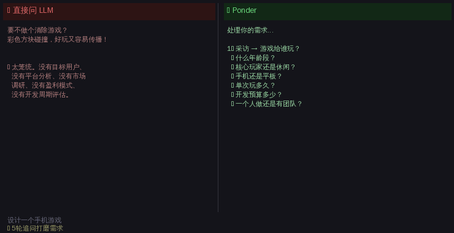

<p align="center">
  
  
  
</p>

<h1 align="center">🧠 Ponder</h1>

<p align="center">
  <b>让 AI 先想清楚，再开口。</b><br>
  <i>代码强制的推理管线 · 越用越准 · 跨领域通用</i>
</p>

<p align="center">
  <a href="README.md">🌐 English</a>
  &nbsp;·&nbsp;
  <code>/luke:ponder &lt;你的问题&gt;</code>
</p>

<br>

---

## ✨ 每次用 AI，你都在赌。

赌它这次答得对。赌它不会漏掉关键信息。赌它不会跟上次一样自信满满地说一个错误答案。

**问题不在模型，在想的过程。**

大多数 LLM 有问必答。Ponder 不——完整入口按固定顺序走完十个阶段：interview（需求画像）→ shensi（神思）→ divergence（发散）→ bagua（八卦镜）→ plans（方案）→ converge（收敛）→ score（评分）→ simulate（推演）→ debate（辩论）→ synthesis（综合）。仅 Ponder 通过阶段指令、转场守卫和完成校验三层机制防止跳步。

结果不是"答得更快"，是**"答得更可信"**。

而且每一次回答，都在让自己变强——因为每次分析的结论都会积累到记忆系统里。系统记得什么对了、什么错了、你纠正过什么。下一次直接用。

---

### 一眼看清

```
你提问
    ↓
┌───────────────────────────────────────────┐
│      采访（五诊画像：天/地/人/法/物）        │
├───────────────────────────────────────────┤
│    shensi      →     divergence           │
│       ↓                   ↓               │
│     bagua       →       plans             │
│       ↓                   ↓               │
│    converge     →       score             │
│       ↓                   ↓               │
│    simulate     → debate → synthesis       │
└───────────────────────────────────────────┘
    ↓
每步代码检查，每步产出积累。下一次更准。
```

<br>

### 看对比



*左侧：直接问 LLM。右侧：同一问题通过 Ponder 完整十阶段流程。*

```

你提问 → interview → shensi → divergence → bagua → plans
       → converge → score → simulate → debate → synthesis

每次分析的结果自动积累到记忆系统。下一次比上一次更准。
```

### 核心亮点

| 能力 | 为什么重要 |
|---|---|
| 🎯 **需求打磨** | 第一步不是分析，是确保你在解决对的问题。带选项的追问，直到画像清晰。 |
| 🌪️ **神思破框** | 不是"换个角度想想"。五步认知工序（虚静→神凝→神游→意象→言意），产出真正的反直觉发现。 |
| 👁️ **八卦镜找盲点** | 8 个维度逐项扫描，找出你没意识到的盲区和隐藏假设。 |
| 📊 **8维方案评分** | 每个方案在可行性、应变力、穿透力、风险等8个维度分别评分，不做单一维度评价。 |
| ⚔️ **辩论攻防** | 方案不是被比较——是被攻击。每个方案承受其他所有方案的联合批判，活下来的才是真强者。 |
| 🧠 **记忆永不丢** | 每次分析产出自动存入 MMA。下次同类问题，系统自动调取 top 3 最相关的历史经验做参考。 |
| 🔄 **自我进化** | 权重注册表根据实际结果自动调整系数。知识有生命周期——新生→验证→确认→沉睡→归档。 |

---

## 🏗 架构一览

```
一个 luke Plugin
├── 九个 Skills
│   ├── ponder: interview → shensi → divergence → bagua → plans
│   │           → converge → score → simulate → debate → synthesis
│   └── 八个独立专项：interview、explore、blindspots、solutions、
│       simulate、debate、synthesis、memory
├── skills/<owner>/resources/     各 Skill 自有 prompt 与 schema
├── engine/                       根目录共享推理基础
├── MMA                           philosophy、knowledge、step_history
├── mcts gateway                  compute、l10n、knowledge、profile
└── 运行时                        PONDER_DATA_DIR；Plugin 只读
```

只有 Ponder 负责十阶段编排和三层防跳步检查。八个专项 Skill 各自独立、可单独调用。

---

## 💡 核心理念

**大多数糟糕决策来自盲点，而不是推理能力不足。**

Ponder 不是在"更努力地思考"——它是在从不同位置思考。每个阶段改变观察者的立脚点：

- **神思** 改变你的精神状态（清空 → 凝聚 → 漫游 → 浮现 → 连接）
- **发散** 改变你的观察尺度（宏观 → 微观 → 时间压缩 → 时间扩展 → 无我）
- **八卦镜** 改变你的评估维度（驱动力 → 基础 → 变化 → 风险 → 边界 → 平衡）
- **方案评分** 改变你的评价标准（可行性 → 应变力 → 穿透力 → 价值）
- **辩论** 改变你的立场（辩护 → 攻击 → 幸存）

一轮分析下来，你已经从 20+ 个不同角度审视过问题。能从这个密度下逃掉的盲点，很少。

---

## 🔄 记忆怎么工作

MMA 保持简单，只使用 `philosophy`、`knowledge`、`step_history` 三个文件。每条知识采用领域中性抽象，同时保留 `original_example` 以便追溯，并记录 `outcomes`，让后续运行依据真实结果学习。

mcts gateway 只有四个接口面：`compute`、`l10n`、`knowledge`、`profile`，不承担编排或守卫职责。

---

## 🚀 快速开始

```bash
# 安装
/plugin marketplace add https://github.com/ljjluke/ponder-skill
/plugin install luke

# 使用——任何领域
/luke:ponder 帮我分析一下A股
/luke:ponder 规划一下Python学习路线
/luke:ponder 分析这个创业项目的竞争格局
/luke:ponder 比较三种营销策略的优劣
/luke:ponder 帮我评估两种治疗方案
# 专项技能——只调用当前需要的能力
/luke:interview 打磨这个项目的需求画像
/luke:explore 质疑这个决策的问题框架
/luke:blindspots 检查这些发现还有哪些盲点
/luke:solutions 生成、收敛并评分可行方案
/luke:simulate 推演这些幸存方案
/luke:debate 对这些方案做抗压辩论和排名
/luke:synthesis 把完整辩论结果综合成建议
/luke:memory 回忆相关历史经验
```

### 自定义存储目录

```bash
# Linux / macOS
export PONDER_DATA_DIR=/mnt/nas/my-knowledge
PONDER_DATA_DIR=/mnt/nas/my-knowledge claude

# Windows (PowerShell)
$env:PONDER_DATA_DIR = "D:\my-knowledge"
claude
```

默认：`~/.claude/data/skills/ponder/`。`PONDER_DATA_DIR` 必须位于 Plugin 安装目录之外。Plugin 根目录在运行时只读；用户要求生成的文件写入调用工程，记忆、指标、学习权重和进化状态只写入该数据目录。

---

## 📁 项目结构

```
ponder-skill/
├── .claude-plugin/                  # 单一 luke Plugin 清单
├── skills/                          # 九个可独立发现的 Skill
│   ├── ponder/SKILL.md              # 十阶段编排与专属守卫
│   ├── interview/ … synthesis/      # 独立专项 Skill
│   ├── memory/SKILL.md              # 独立记忆专项
│   └── <owner>/resources/           # prompt 随所属 Skill 放置
├── engine/                          # 根目录共享推理基础
├── scripts/mma/                     # philosophy、knowledge、step_history
├── scripts/mcts/                    # compute、l10n、knowledge、profile
├── hooks/                           # 会话生命周期集成
└── assets/                          # 文档媒体
```

---

## 🧘 设计哲学

| 原则 | 含义 |
|------|------|
| **一个 Plugin，九个 Skills** | `luke` 是唯一 Plugin；Ponder 是完整十阶段 Skill，另外八个专项均可独立调用。 |
| **仅 Ponder 编排** | 只有 `skills/ponder/SKILL.md` 持有阶段顺序和三层防跳步机制。 |
| **prompt 归 owner，共享基础归根目录** | prompt 位于 `skills/<owner>/resources/`；可复用推理基础统一位于根 `engine/`。 |
| **简单 MMA** | 记忆只有 `philosophy`、`knowledge`、`step_history`，使用领域中性抽象并保留 `original_example` 和 `outcomes`。 |
| **Plugin 只读** | 运行时写入 `PONDER_DATA_DIR`，不修改已安装 Plugin。 |
| **窄接口 gateway** | mcts gateway 只提供 `compute`、`l10n`、`knowledge`、`profile`。 |

---

<p align="center">
  <sub>Claude Code 认知框架 · 用 ❤️ 构建 · 不是提示词，是一个大脑</sub>
</p>
